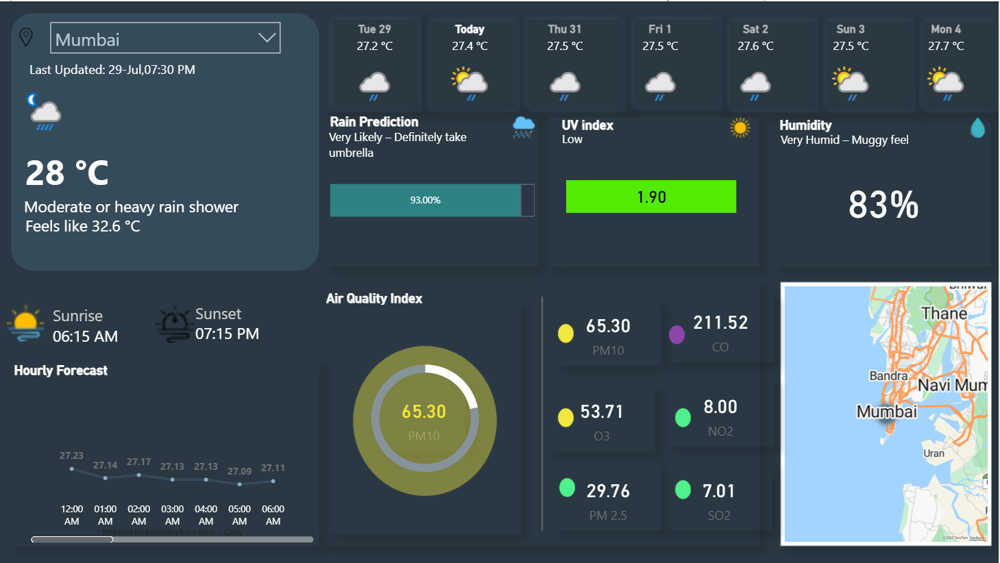
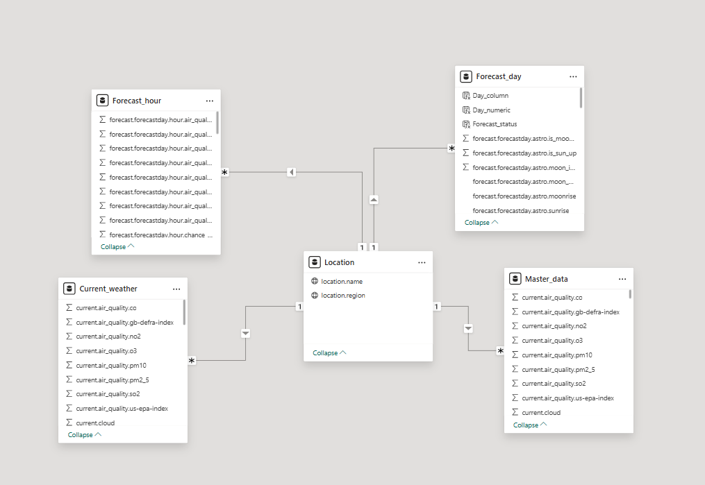

# 🌦️ Weather Dashboard – Power BI Project

This Power BI dashboard visualizes weather trends across 7 different cities and dates. It includes dynamic charts, KPIs, and filters to help users explore temperature, humidity, and rainfall data interactively.

## 🛠 Tools Used
- Power BI Desktop
- DAX
- API - https://www.weatherapi.com/

## 📊 Key Features
- Filters for city and date range
- KPIs: Avg Temperature, Humidity, Rainfall,AQI,Hourly forecast
- Line charts for hourly trend , AQI chart 

## 📸 Screenshots

## 📂 Files Included
    Weather_API_project.pbix 

## 📘 How to Use
1. Clone or download the repo
2. Open  Weather_dashboard.Weather_API_project.pbix in Power BI Desktop
3. Load the sample data and explore the dashboard